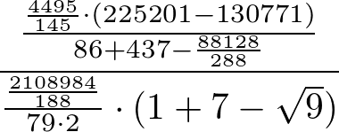

number-obfuscator
=================

## What is it

A simple tool written with Ruby and TeX to create large arithmetic expressions
for a given number, like this:

or this:

[Here is an old blog post with more information.](https://mwolf.net/2009/06/07/number-obfuscator/).

## How to use it

There's an on-line version [here](http://mail.mwolf.net/code/obfuscator/obfuscate.html) where you can
experiment with it for yourself. It's currently on a self-hosted server, though, so please be
gentle!

Alternatively, you can fork the [git repo](https://github.com/mwolf-net/number-obfuscator) or
simply download the [zipfile](https://github.com/mwolf-net/number-obfuscator/archive/master.zip) and
run the script locally.

### Prerequisites

To generate images with the script, you need to have *TeX* installed, plus the helper utilities
*texi2dvi* and *dvipng*. On Ubuntu, you can install this with
`sudo apt-get install texinfo texlive dvipng`.

### Running the script

The basic command is

    ruby number_obfuscator.rb [n] [d] [format]
    
where *n* is the number you want to obfuscate, *d* is the depth (try 3 for a fairly simple
expression, or 6 for a really nasty one) and *format* is either *tex* or *png*. If you don't specify
a format, the formula will be output as a Ruby expression. If you specify png, the file will be
saved as _obfuscated.png_.

In addition to invoking the script from the commandline, you can also load it from another Ruby
script, like this:

    require './number_obfuscator'

    e = Obfuscator.generate(n, d)
    Obfuscator.makePNG(e, 'output.png')

A separate CGI script, number_obfuscator_cgi.rb, is provided for running on a webserver. Once you have
it running (which is outside the scope of this README file, sorry) it's just a matter of calling it
with a GET request, passing the *n* and *d* parameters, as demonstrated by the on-line demo linked to
above. Configuring your server to use *mod_ruby* is strongly recommended.

That's it, have fun! And please [let me know](https://github.com/mwolf-net/number-obfuscator/issues)
if it doesn't work, or if you have any improvement suggestions..

