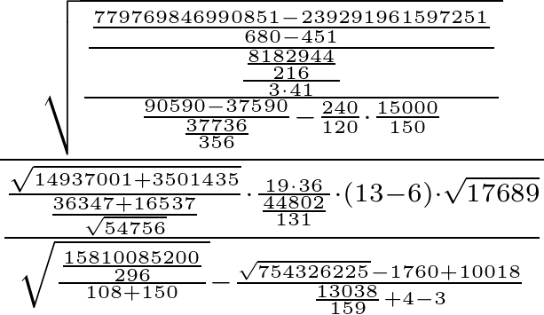

number-obfuscator
=================

## What is it

A simple tool written with Ruby and TeX to create large arithmetic expressions
for a given number, like this:

or this:

[Here is an old blog post with more information.](http://mwolf.net/archive/number-obfuscator/).

## How to use it

There's an on-line version [here](http://mwolf.net/code/obfuscator/obfuscate.html) where you can
experiment with it for yourself. It's currently on a self-hosted server, though, so please be
gentle!

Alternatively, you can fork the [git repo](https://github.com/mwolf-net/number-obfuscator) or
simply download the [zipfile](https://github.com/mwolf-net/number-obfuscator/archive/master.zip) and
run the script locally.

### Prerequisites

To generate images with the script, you need to have *TeX* installed; specifically, the *texi2dvi*
program. On Ubuntu, you can install this with `sudo apt-get install texinfo`.

To generate pictures in .png format, you also need the *convert* program, which you can install with
`sudo apt-get install imagemagick`.

If you want to run the script on your own webserver, installing *mod_ruby* is strongly recommended.

### Running the script

The basic command is

    ruby number_obfuscator.rb [n] [d] [format]
    
where *n* is the number you want to obfuscate, *d* is the depth (try 3 for a fairly simple
expression, or 6 for a really nasty one) and *format* is either *tex* or *png*. If you don't specify
a format, the formula will be output as a Ruby expression.

That's it, have fun! And please [let me know](https://github.com/mwolf-net/number-obfuscator/issues)
if it doesn't work, or if you have any improvement suggestions..

